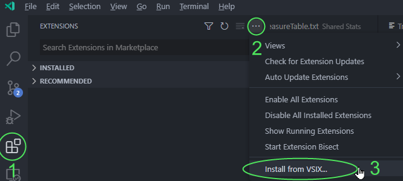

# BG3 Syntax VSCode Extension

This is a [Visual Studio Code](https://code.visualstudio.com/) extension that adds syntax highlighting support for Baldur's Gate 3 stats files (.txt) and behavior scripting files (.charScript, .itemScript, .gameScript).

## Installing

Grab the latest release here:  
[Latest Release](https://github.com/LaughingLeader/bg3-syntax/releases/latest/download/bg3-syntax.vsix)

Install the extension from within VSCode:  

More info:  
* [Install from a VSIX (code.visualstudio.com)](https://code.visualstudio.com/docs/editor/extension-marketplace#_install-from-a-vsix)
